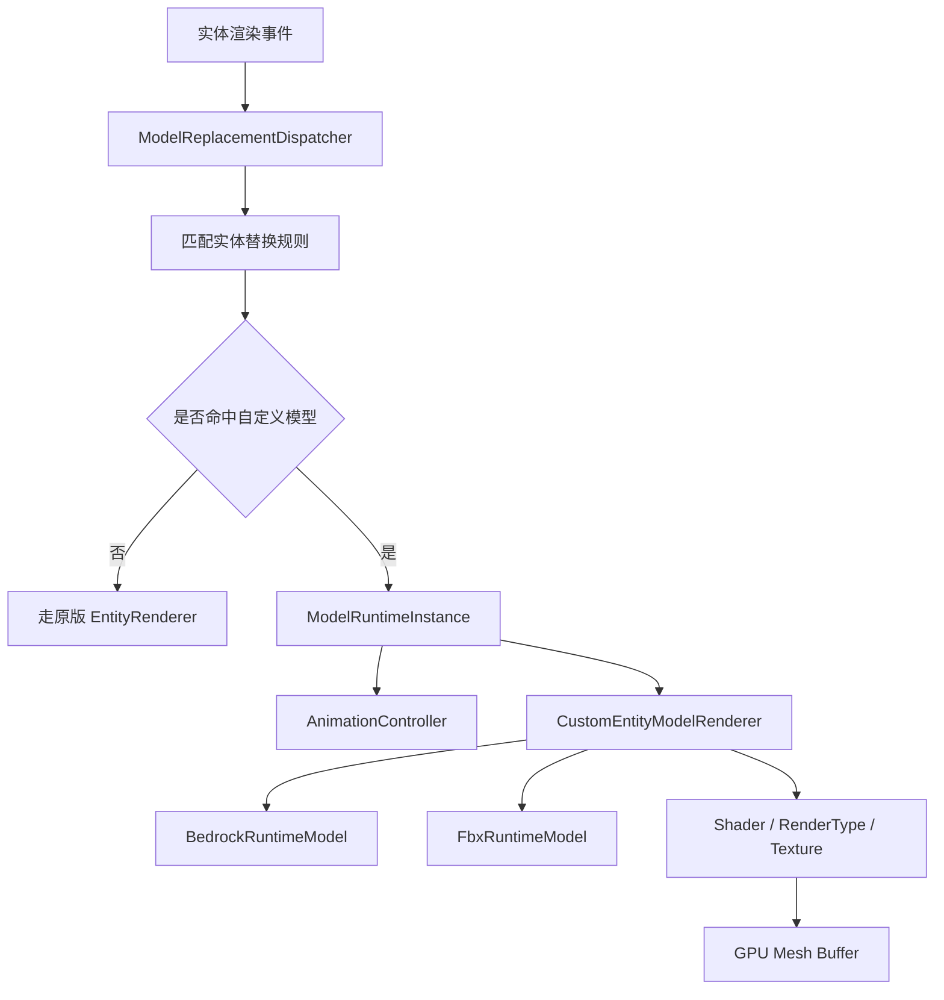
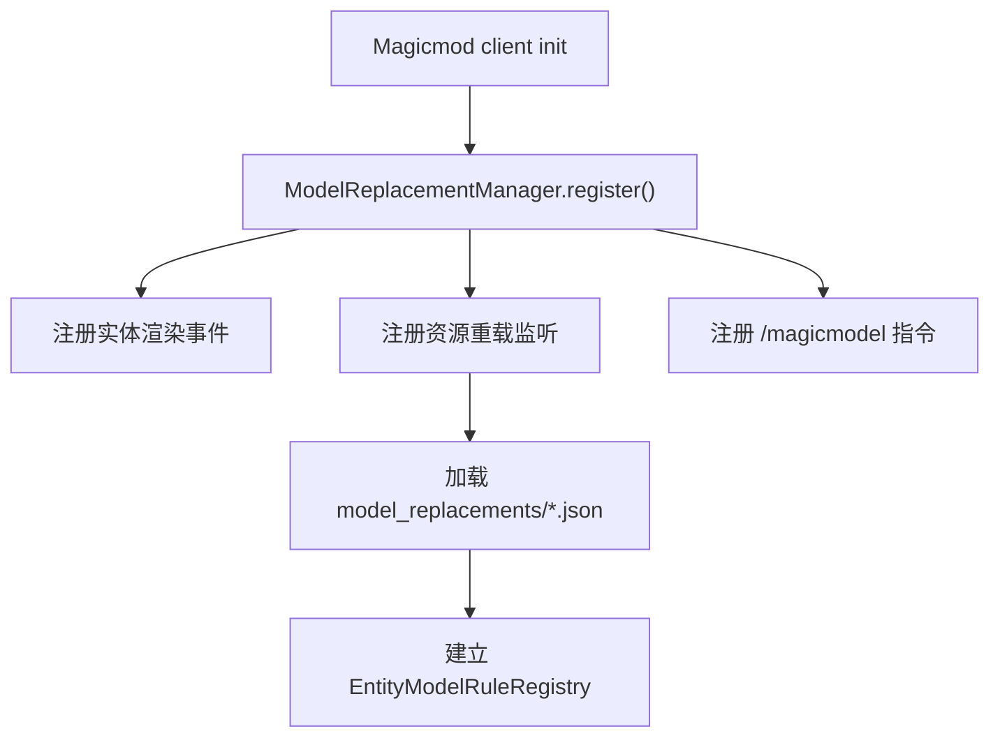
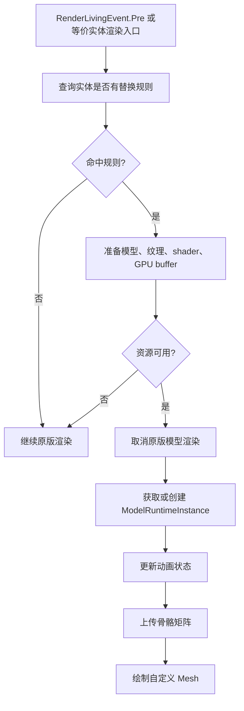
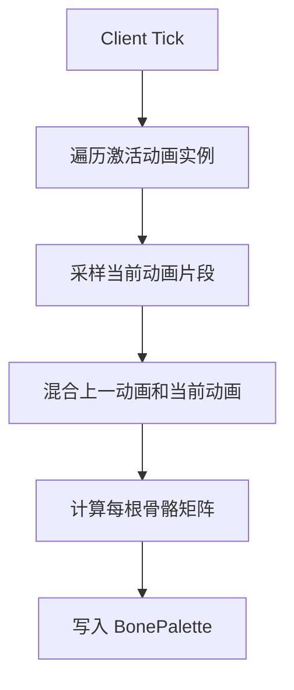
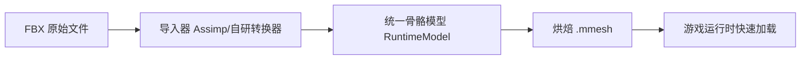

# 实体模型替换与动画系统策划文档

## 目标

本功能目标是为 MagicMod 增加一套类似 DragonCore 的客户端实体模型替换系统，使玩家、怪物、NPC 或指定实体可以在游戏内被替换为自定义模型，并支持播放自定义动画。

目标版本为 Minecraft Forge `1.21.11`。

核心能力：

- 支持将原版实体模型替换为 Bedrock Edition 模型。
- 支持将原版实体模型替换为 FBX 模型。
- 支持 Bedrock 模型动画。
- 支持 FBX 模型动画。
- 支持按实体类型、实体 UUID、玩家名、NBT/标签或指令动态替换。
- 支持通过指令播放、切换、停止指定模型动画。
- 支持资源热重载，并确保模型、动画、纹理、GPU buffer 不泄漏。

## 功能边界

### 第一阶段必须实现

- 客户端可替换实体渲染，不改变服务端实体逻辑。
- Bedrock `geo.json` 模型加载、骨骼层级解析、贴图绑定。
- Bedrock `animation.json` 动画加载与播放。
- FBX 模型导入到统一运行时模型格式。
- 通过配置文件将实体类型映射到模型。
- 通过客户端指令临时替换模型与播放动画。
- 资源重载、退出世界、关闭客户端时释放缓存。

### 第二阶段再实现

- 服务端下发模型替换规则。
- 多人同步动画状态。
- 与技能、装备、状态机、攻击动作绑定。
- 模型编辑器辅助工具。
- 动画混合树、分层动画、IK、挂点系统。

## 三轮复审补充

本节是对方案进入实现前的三次审查结论。原方案方向可行，但下面这些点必须补进设计，否则实现到实体渲染和资源重载阶段时风险会明显上升。

### 第一遍：Forge 1.21.11 接入修正

已核对 Forge `1.21.11-61.1.3` 的客户端事件形态：

- `RenderLivingEvent.Pre` 存在，并且是可取消事件。
- 事件参数已经不是旧版单纯的即时 buffer 流程，而是包含 `LivingEntityRenderState`、`PoseStack`、`SubmitNodeCollector`、`CameraRenderState`。
- `EntityRenderersEvent.RegisterRenderers` 可注册实体渲染器，`EntityRenderersEvent.AddLayers` 可访问玩家模型类型和已有实体渲染器。

因此渲染接入要按 1.21.11 的状态提交管线设计：

1. 第一阶段用 `RenderLivingEvent.Pre` 做通用 LivingEntity 替换入口。
2. 命中替换规则后，先确保自定义模型、纹理、shader 和 GPU buffer 都可用，再取消原版渲染。
3. 自定义渲染失败时必须回退原版渲染，不允许先取消原版再抛异常。
4. 不直接修改或缓存原版 `LivingEntityRenderer`、原版 `EntityModel` 的可变字段，避免影响同类型其他实体。
5. 需要完全替换某些实体类型时，再考虑在 `EntityRenderersEvent.RegisterRenderers` 注册包装渲染器。
6. 玩家模型、皮肤层、披风、盔甲层等先作为第二阶段处理，通过 `EntityRenderersEvent.AddLayers` 或后续确认的玩家层接口补充。

指令也要拆成两类，避免把客户端调试命令写成服务端权威命令：

- 客户端调试命令：用于单机或开发环境，可按准星实体、客户端已知 UUID、实体类型、本地玩家名进行替换。
- 服务端权威命令：用于多人环境，才能稳定支持 `@e`、`@s`、NBT 条件、标签和权限控制。

因此文档里的 `selector` 示例应理解为服务端命令或集成服务器命令。纯客户端命令不应承诺完整解析服务端选择器。

### 第二遍：资源格式与动画修正

Bedrock 支持不能只按单一 JSON 结构写死。第一版至少要明确兼容策略：

- 优先支持新版 `minecraft:geometry` 数组结构。
- 旧式 `geometry.<name>` 映射结构可以作为兼容项，但不阻塞第一版验收。
- `pivot`、`rotation`、`origin`、`size`、`inflate`、`mirror` 必须经过统一坐标转换层。
- Bedrock 角度通常按度描述，运行时矩阵计算前要统一转换为弧度或明确内部单位。
- Bedrock UV 盒子和 Java 渲染顶点 UV 展开方式不同，必须在导入期展开成统一顶点。
- `animation.json` 第一版只支持数值 keyframe、基础 position/rotation/scale 和简单 loop。
- Molang 表达式、`pre_effect_script`、复杂 query 变量、粒子/音效事件先列为第二阶段，不应在第一版承诺完整支持。

FBX 支持必须采用“导入格式”和“运行时格式”分离：

- 第一版不建议把 FBX native 解析器作为正式运行时必需依赖。
- 推荐开发期或资源加载期转换为 `.mmesh`，正式渲染只加载 `.mmesh`。
- 必须处理单位缩放、Y-up/Z-up、左右手坐标系、骨骼 bind pose 和 root motion 策略。
- 第一版材质限制为一个 mesh part 一个主纹理和一个 UV0；多材质、多 UV、PBR 材质后续扩展。
- FBX 动画应在导入期按固定采样率烘焙，运行时不再遍历原始 FBX 曲线。
- root motion 第一版建议只作为视觉位移，不改变服务端实体位置。

统一运行时模型应先于正式 FBX 功能落地。也就是说，Bedrock 和 FBX 都应转换到同一套 `RuntimeModel`、`RuntimeSkeleton`、`RuntimeAnimationClip`、`RuntimeMeshPart`，否则后续 shader、缓存、动画混合会出现两套逻辑。

### 第三遍：内存、性能与验收修正

资源生命周期需要比原方案更严格：

- 缓存键必须包含模型 id、纹理 id、render mode、导入器版本、资源包 reload 版本号。
- 资源重载后旧缓存必须整体失效，不能只按模型 id 覆盖。
- GPU buffer、shader 相关对象和动态纹理释放必须在渲染线程执行；如果 reload 回调不在渲染线程，需要投递到 render thread。
- 共享的模型、动画、纹理、GPU buffer 使用引用计数或集中 cache 管理，单个实体实例不能直接拥有并关闭共享资源。
- 实体运行时状态应优先用 entity id 加当前 world/session id 管理，不能用静态 `UUID -> Instance` 永久持有实体对象。
- 退出世界、断开服务器、资源重载、关闭客户端、实体移除时都必须清理 animation state。
- 动画 tick 不能每帧创建 `Matrix4f[]`、临时 `Vector3f` 列表或 JSON 对象。
- 任何导入失败的半成品资源都要进入 `try/finally` 清理路径，避免 VBO、NativeImage、纹理引用残留。

性能验收也需要前置：

- 100 个同模型替换实体同时播放 idle/walk 动画时，模型 mesh 和动画 clip 只能各缓存一份。
- 远距离实体降低动画采样频率，离开视锥的实体可以暂停骨骼上传。
- 第一版优先支持 `cutout` 和 `solid`，`translucent` 必须明确排序风险，不能作为核心验收。
- 骨骼数量第一版限制为 128；超过限制应导入失败或拆分 mesh part。
- 每顶点骨骼权重最多 4 个，导入期归一化，shader 不处理任意数量权重。

验收必须增加真实游戏内闭环：

- 新增类似现有 `ClientSmokeTest` 的模型替换 smoke test，例如 `-Dmagicmod.smokeTestModel=true`。
- 在单人世界中自动生成或锁定一个测试实体，执行替换、播放动画、停止动画、清理替换、reload。
- 重复进入/退出世界 10 次后，`runtimeInstances`、临时纹理、VBO/IBO 计数必须回落到 0。
- 连续执行 `/magicmodel reload` 10 次后，旧模型和旧 GPU buffer 不残留。
- 导入错误资源时客户端不崩溃，日志有明确错误，实体回退原版渲染。

## 总体架构



建议新增模块：

- `org.test.magicmod.model`
  - 模型资源抽象、统一 runtime mesh、骨骼结构。
- `org.test.magicmod.model.bedrock`
  - Bedrock `geo.json` 和 `animation.json` 解析。
- `org.test.magicmod.model.fbx`
  - FBX 导入、转换、烘焙。
- `org.test.magicmod.model.animation`
  - 动画片段、骨骼采样、混合、状态控制。
- `org.test.magicmod.model.render`
  - 实体替换渲染器、shader、buffer 管理。
- `org.test.magicmod.model.command`
  - 指令注册与调试命令。
- `org.test.magicmod.model.network`
  - 后续多人同步包。

## 资源目录设计

建议资源路径：

```text
assets/magicmod/entity_models/bedrock/<name>.geo.json
assets/magicmod/entity_models/bedrock/<name>.animation.json
assets/magicmod/entity_models/fbx/<name>.fbx
assets/magicmod/entity_models/runtime/<name>.mmesh
assets/magicmod/textures/entity_models/<name>.png
assets/magicmod/model_replacements/<rule>.json
data/magicmod/model_replacements/<rule>.json
```

说明：

- Bedrock 模型可以直接读取 `geo.json`。
- FBX 不建议每次进游戏都完整解析原始文件，应在开发期或资源加载期转换成统一 runtime mesh。
- `.mmesh` 是建议新增的中间格式，用于缓存烘焙后的顶点、索引、骨骼、动画曲线，减少运行时开销。
- `assets/.../model_replacements` 用于纯客户端视觉规则，适合资源包自带默认替换。
- `data/.../model_replacements` 用于服务端权威规则，适合多人同步和权限控制。
- 所有外部资源路径都必须是 `Identifier`，禁止读取任意绝对路径，避免资源包逃逸和安全问题。

## 配置文件设计

### 实体类型替换

```json
{
  "id": "magicmod:zombie_bedrock_replace",
  "priority": 100,
  "target": {
    "type": "entity_type",
    "entity": "minecraft:zombie"
  },
  "model": {
    "format": "bedrock",
    "geometry": "magicmod:entity_models/bedrock/zombie.geo.json",
    "texture": "magicmod:textures/entity_models/zombie.png",
    "animation": "magicmod:entity_models/bedrock/zombie.animation.json"
  },
  "default_animation": "animation.zombie.idle",
  "scale": 1.0,
  "render_mode": "cutout",
  "shadow": true
}
```

### 玩家名替换

```json
{
  "id": "magicmod:player_custom_model",
  "priority": 200,
  "target": {
    "type": "player_name",
    "name": "Dev"
  },
  "model": {
    "format": "fbx",
    "source": "magicmod:entity_models/fbx/player_knight.fbx",
    "texture": "magicmod:textures/entity_models/player_knight.png"
  },
  "default_animation": "idle",
  "scale": 0.85,
  "render_mode": "translucent"
}
```

### 标签或 NBT 条件替换

```json
{
  "id": "magicmod:boss_tag_replace",
  "priority": 300,
  "target": {
    "type": "tag",
    "tag": "magic_boss"
  },
  "model": {
    "format": "bedrock",
    "geometry": "magicmod:entity_models/bedrock/boss.geo.json",
    "texture": "magicmod:textures/entity_models/boss.png",
    "animation": "magicmod:entity_models/bedrock/boss.animation.json"
  },
  "default_animation": "animation.boss.idle",
  "scale": 1.5,
  "render_mode": "cutout"
}
```

## 指令设计

基础命令建议使用 `/magicmodel`，避免和已有 `/open` UI 命令混淆。

指令分为两套语义：

- 客户端调试指令：只影响本客户端，适合开发、单人世界调试和资源包验证。
- 服务端同步指令：由服务端校验权限和选择器，再通过网络包同步给客户端，适合多人服。

下面示例中的 `<selector>` 在多人环境下必须由服务端命令处理。纯客户端命令只应支持本地玩家、准星实体、客户端可见 UUID 或实体类型级规则。

### 替换模型

```mcfunction
/magicmodel client replace target bedrock <geometry> <texture>
/magicmodel client replace target fbx <model> <texture>
/magicmodel server replace entity <selector> bedrock <geometry> <texture>
/magicmodel server replace entity <selector> fbx <model> <texture>
/magicmodel server replace type <entity_type> bedrock <geometry> <texture>
/magicmodel server replace type <entity_type> fbx <model> <texture>
```

示例：

```mcfunction
/magicmodel client replace target bedrock magicmod:entity_models/bedrock/zombie.geo.json magicmod:textures/entity_models/zombie.png
/magicmodel server replace entity @e[type=minecraft:zombie,limit=1] bedrock magicmod:entity_models/bedrock/zombie.geo.json magicmod:textures/entity_models/zombie.png
/magicmodel server replace entity @s fbx magicmod:entity_models/fbx/player_knight.fbx magicmod:textures/entity_models/player_knight.png
```

### 播放指定动画

```mcfunction
/magicmodel client animation play target <animation>
/magicmodel client animation play target <animation> loop
/magicmodel client animation play target <animation> once
/magicmodel client animation stop target
/magicmodel client animation reset target
/magicmodel server animation play <selector> <animation>
/magicmodel server animation play <selector> <animation> loop
/magicmodel server animation play <selector> <animation> once
/magicmodel server animation stop <selector>
/magicmodel server animation reset <selector>
```

示例：

```mcfunction
/magicmodel client animation play target idle loop
/magicmodel server animation play @s idle loop
/magicmodel server animation play @e[type=minecraft:zombie,limit=1] attack once
/magicmodel server animation stop @s
```

### 清理和调试

```mcfunction
/magicmodel client clear target
/magicmodel server clear <selector>
/magicmodel reload
/magicmodel client debug target
/magicmodel server debug entity <selector>
/magicmodel debug cache
/magicmodel debug dump
```

说明：

- `clear` 恢复原版实体模型。
- `reload` 重新加载模型替换规则和模型缓存。
- `debug cache` 输出当前模型、动画、纹理、VBO/IBO 缓存数量。
- `debug dump` 输出当前所有替换实例，方便排查内存泄漏。

## 调用链设计

### 启动阶段



### 渲染阶段



### 动画阶段



## Bedrock 模型支持方案

### 需要解析的内容

- `minecraft:geometry`
- `description.identifier`
- `texture_width`
- `texture_height`
- `bones`
- `cubes`
- `pivot`
- `rotation`
- `uv`
- `inflate`
- `mirror`

### 骨骼结构

运行时统一为：

```java
record RuntimeBone(
    String name,
    int parentIndex,
    Vector3f pivot,
    Vector3f bindRotation,
    List<Integer> meshPartIndices
) {}
```

### 动画结构

Bedrock 动画统一转换为：

```java
record RuntimeAnimationClip(
    String name,
    float lengthSeconds,
    boolean loop,
    Map<String, BoneAnimationChannel> channels
) {}
```

支持通道：

- position
- rotation
- scale

插值模式：

- linear
- step
- catmullrom 可作为第二阶段优化

## FBX 模型支持方案

FBX 比 Bedrock 复杂，建议不要把 FBX 直接作为每次运行时解析的主格式，而是分成导入格式和运行时格式。

### 推荐方案



### 导入方式选择

方案 A：开发期离线转换。

- 优点：运行时稳定，内存可控，启动快。
- 缺点：需要额外转换命令。
- 推荐程度：最高。

方案 B：客户端资源加载时通过 Assimp 解析 FBX。

- 优点：使用体验直接。
- 缺点：native 依赖复杂，崩溃风险和发行包体积增加。
- 推荐程度：仅用于开发模式或可选模块。

方案 C：只支持导出后的 glTF，再从 glTF 转 runtime mesh。

- 优点：生态更现代，动画和骨骼结构更清晰。
- 缺点：用户必须先把 FBX 转成 glTF。
- 推荐程度：可作为 FBX 的兼容兜底。

### FBX 运行时必须统一的信息

- mesh
- material slot
- texture path
- skeleton
- bone weights
- animation stacks
- animation layers
- keyframes
- bind pose
- inverse bind matrices

### 顶点权重限制

建议每个顶点最多保留 4 个骨骼权重：

- 按权重降序保留 Top 4。
- 重新归一化权重。
- 超过限制的权重在导入阶段丢弃。

这样可以保持 shader 简洁，避免每帧过多矩阵读取。

## 统一运行时模型格式

无论 Bedrock 还是 FBX，最终都转成统一结构：

```java
final class RuntimeModel {
    Identifier id;
    RuntimeSkeleton skeleton;
    List<RuntimeMeshPart> meshParts;
    Map<String, RuntimeAnimationClip> animations;
    BoundingBox bounds;
}
```

```java
final class RuntimeMeshPart {
    Identifier texture;
    RenderMode renderMode;
    GpuMeshBuffer buffer;
    int vertexCount;
    int indexCount;
}
```

顶点格式建议：

```text
position: float3
normal: float3
uv: float2
boneIndex: ubyte4
boneWeight: unorm8x4 或 float4
color: ubyte4 可选
```

## Shader 设计

### 顶点 Shader 输入

```glsl
#version 150

in vec3 Position;
in vec3 Normal;
in vec2 UV0;
in vec4 BoneIndices;
in vec4 BoneWeights;

uniform mat4 uProjection;
uniform mat4 uView;
uniform mat4 uModel;
uniform mat4 uBones[128];

out vec2 vUv;
out vec3 vNormal;

void main() {
    mat4 skin =
        uBones[int(BoneIndices.x)] * BoneWeights.x +
        uBones[int(BoneIndices.y)] * BoneWeights.y +
        uBones[int(BoneIndices.z)] * BoneWeights.z +
        uBones[int(BoneIndices.w)] * BoneWeights.w;

    vec4 worldPos = uModel * skin * vec4(Position, 1.0);
    gl_Position = uProjection * uView * worldPos;
    vUv = UV0;
    vNormal = normalize(mat3(uModel * skin) * Normal);
}
```

### 片元 Shader 输入

```glsl
#version 150

uniform sampler2D Sampler0;
uniform vec4 uTint;
uniform float uAlpha;
uniform int uRenderMode;

in vec2 vUv;
in vec3 vNormal;

out vec4 fragColor;

void main() {
    vec4 tex = texture(Sampler0, vUv);

    if (uRenderMode == 0 && tex.a < 0.1) {
        discard;
    }

    float light = clamp(dot(normalize(vNormal), normalize(vec3(0.25, 0.85, 0.45))), 0.35, 1.0);
    vec4 color = tex * uTint;
    fragColor = vec4(color.rgb * light, color.a * uAlpha);
}
```

### Shader 注意点

- 骨骼数量建议第一版限制为 128。
- 超过 128 根骨骼的模型导入时给出错误或分批绘制。
- 半透明模型必须按 Minecraft 现有 translucent 队列处理。
- cutout 模型优先使用 discard，减少排序问题。

## 动画系统设计

### 动画状态

每个被替换实体持有一个运行时状态：

```java
final class ModelAnimationState {
    String currentAnimation;
    String previousAnimation;
    float timeSeconds;
    float blendSeconds;
    boolean loop;
    Matrix4f[] bonePalette;
}
```

### 播放规则

- `loop`：循环播放。
- `once`：播放一次后回到默认动画。
- `hold`：播放结束后停在最后一帧。
- `blend`：从当前 pose 混合到新动画。

### 动画优化

- 不允许每帧重新解析 JSON/FBX。
- 不允许每帧重新创建大量 `Matrix4f` 对象。
- `bonePalette` 数组按实例复用。
- 动画 keyframe 在资源加载期预处理。
- 对重复 keyframe 做压缩。
- 对静态骨骼跳过采样。

## 实体替换规则

### 匹配优先级

建议优先级从高到低：

1. UUID 精确匹配。
2. 玩家名匹配。
3. 实体标签匹配。
4. NBT 条件匹配。
5. 实体类型匹配。
6. 默认规则。

### 替换语义

替换模型只替换视觉层：

- 不改变碰撞箱。
- 不改变 AI。
- 不改变服务端实体类型。
- 不改变攻击判定。
- 不改变装备逻辑。

但渲染层可以读取实体状态：

- 移动速度。
- 是否攻击。
- 是否受伤。
- 是否死亡。
- 是否在地面。
- 玩家名。
- 主副手物品。

后续可以把这些状态映射到动画状态机。

## 动画状态机

第一版可先用简单规则：

```json
{
  "state_machine": {
    "idle": {
      "animation": "idle",
      "when": "speed <= 0.01"
    },
    "walk": {
      "animation": "walk",
      "when": "speed > 0.01 && speed < 0.2"
    },
    "run": {
      "animation": "run",
      "when": "speed >= 0.2"
    },
    "hurt": {
      "animation": "hurt",
      "when": "hurt_time > 0",
      "priority": 50
    }
  }
}
```

第二版再支持：

- 分层动画。
- 上半身攻击、下半身行走混合。
- 动画事件帧。
- 粒子/音效/挂点事件。

## 挂点系统

为后续武器、翅膀、特效预留挂点：

```json
{
  "attachments": {
    "right_hand": {
      "bone": "rightArm",
      "offset": [0.0, 0.0, 0.0],
      "rotation": [0.0, 0.0, 0.0]
    }
  }
}
```

可用于：

- 渲染手持武器。
- 挂载粒子。
- 挂载光效。
- 挂载额外模型。

## 内存与资源生命周期

### 需要缓存的内容

- 模型解析结果。
- 动画解析结果。
- 烘焙后的 mesh。
- GPU VBO/IBO。
- 纹理引用。
- 每个实体的 animation state。

### 释放时机

- 客户端退出世界。
- 资源包重载。
- `/magicmodel reload`。
- `/magicmodel client clear target`。
- `/magicmodel server clear <selector>`。
- 客户端关闭。

### 防泄漏要求

- `GpuMeshBuffer` 必须实现显式 `close()`。
- 每个 `glGenBuffers` 必须有对应 `glDeleteBuffers`。
- 每个动态纹理必须通过 `TextureManager.release(...)` 释放。
- `world/session id + entity id -> ModelRuntimeInstance` 映射必须在实体移除时清理。
- 资源 reload 前必须清空旧缓存。
- 不允许 `static Map` 永久持有世界实体实例。
- 动画 tick 不允许持续创建临时对象。

### 建议调试指标

```text
loadedModels=12
loadedAnimations=18
gpuMeshes=12
runtimeInstances=35
bonePaletteBytes=286720
textureReferences=12
```

## 性能优化策略

### 模型加载优化

- Bedrock JSON 解析后立即转成不可变 runtime model。
- FBX 导入后尽量写入 `.mmesh` 缓存。
- 相同模型只保留一份 mesh。
- 相同动画只保留一份 clip。

### 顶点优化

- 合并同材质 mesh part。
- 删除不可见面。
- 统一顶点格式。
- 使用 index buffer。
- 小模型优先 16-bit index。
- 顶点权重最多 4 个。
- 导入期去除零权重骨骼。

### 动画优化

- 预计算 inverse bind matrix。
- 预处理 keyframe 时间轴。
- 对静态骨骼跳过每帧采样。
- 动画状态使用对象池或复用数组。
- 远距离实体降低动画采样频率。

### 渲染优化

- 按 RenderType、texture、shader 分组。
- 同一模型多实体渲染时复用 mesh buffer。
- 远距离实体使用低频动画或 LOD。
- 可选：未来做 instanced rendering。

## 多人同步设计

第一版可以只做客户端本地效果。

第二版需要网络同步：

```text
Server -> Client:
  SyncModelReplacePacket
  PlayModelAnimationPacket
  StopModelAnimationPacket
  ClearModelReplacePacket

Client -> Server:
  RequestModelDebugPacket
```

服务端只同步规则和状态，不传输模型文件。

模型文件仍由客户端资源包提供。

## 开发阶段划分

### 阶段 1：运行时模型基础

- 定义 `RuntimeModel`、`RuntimeSkeleton`、`RuntimeAnimationClip`、`RuntimeMeshPart`。
- 定义 `GpuMeshBuffer.close()` 和渲染线程释放队列。
- 定义模型、动画、纹理、GPU buffer 的统一 cache。
- 完成 debug cache 计数。

验收：

- 加载和释放一个测试 runtime mesh 后，缓存计数能回到 0。
- 重复 reload 不产生旧 buffer 或旧纹理残留。

### 阶段 2：基础替换链路

- 新增替换规则加载。
- 拦截实体渲染。
- 为指定实体准备自定义资源，资源可用后再取消原版渲染。
- 绘制一个简单 runtime mesh。
- 完成 `/magicmodel client replace target` 和 `/magicmodel client clear target`。

验收：

- 僵尸可以被替换为一个简单方块模型。
- 清除后恢复原版渲染。
- 故意配置错误模型时不崩溃，并回退原版渲染。

### 阶段 3：Bedrock 模型

- 解析 `geo.json`。
- 支持 bone/cube/pivot/uv。
- 支持 texture。
- 支持 cutout render mode。

验收：

- 指定实体可以显示 Bedrock 模型。
- 多个同类型实体共享模型缓存。

### 阶段 4：Bedrock 动画

- 解析 `animation.json`。
- 支持 idle/walk/attack 动画播放。
- 支持 `/magicmodel client animation play target`。

验收：

- 指令可以让指定实体播放指定动画。
- 动画循环和一次性播放都正常。

### 阶段 5：FBX 导入

- 选择 FBX 导入策略。
- 支持 skeleton、mesh、animation stack。
- 转换成统一 runtime model。
- 可选写入 `.mmesh` 缓存。

验收：

- 指定实体可以显示 FBX 模型。
- FBX 动画可以播放。

### 阶段 6：资源生命周期和压测

- 完成 reload 清理。
- 完成实体卸载清理。
- 完成 debug cache 指令。
- 对 100 个替换实体做压测。

验收：

- 重复进入/退出世界 10 次，缓存数量回落到 0。
- `/magicmodel reload` 后旧 VBO/纹理不残留。
- 100 个实体动画播放无明显卡顿。

## 验收清单

- `1.21.11` 下可正常启动客户端。
- 单人世界中实体模型可替换。
- Bedrock 模型显示正常。
- FBX 模型显示正常。
- Bedrock 动画可按名称播放。
- FBX 动画可按名称播放。
- `/magicmodel client clear target` 和 `/magicmodel server clear <selector>` 可以恢复原版模型。
- 资源重载后模型可重新加载。
- 退出世界后 runtime instance 清空。
- 关闭客户端后无残留 Java 进程。
- 无 crash report。
- 日志无 MagicMod 渲染异常。
- 无已知 GPU buffer、动态纹理、实体引用泄漏。
- `-Dmagicmod.smokeTestModel=true` 可在单人世界自动完成替换、动画、清理、reload 验证。
- 连续 reload 10 次后，debug cache 中旧模型、旧动画、旧纹理、旧 VBO/IBO 不增长。
- 进入/退出世界 10 次后，runtime instance 和 animation state 计数回到 0。
- 错误模型、错误动画名、缺失纹理不会导致客户端崩溃，实体回退原版渲染。

## 风险与建议

- FBX 格式复杂，强烈建议优先做离线转换或缓存格式，不建议每帧或每次渲染时解析 FBX。
- 直接引入 Assimp native 依赖会增加打包、平台兼容和崩溃排查成本。
- Bedrock 模型坐标、pivot、旋转顺序和 Java 版渲染坐标不同，需要建立专门转换层。
- 半透明模型排序在实体渲染里容易出问题，第一版优先支持 cutout。
- 动画状态同步在多人环境里必须由服务端统一下发，否则不同客户端会看到不同动作。
- 模型替换不应该改变碰撞箱，否则会牵涉服务端实体逻辑，复杂度会明显上升。

## 推荐优先级

1. 先做统一 runtime mesh、runtime skeleton、runtime animation clip 和资源生命周期框架。
2. 再做最小实体替换链路：命中规则、渲染自定义 mesh、失败回退原版。
3. 再做 Bedrock 模型导入，把 `geo.json` 转为统一 runtime model。
4. 再做 Bedrock 动画播放和 `/magicmodel client animation` 调试命令。
5. 再做 `.mmesh` 缓存格式和 FBX 离线转换链路。
6. 再做服务端同步命令、网络包和多人动画状态同步。
7. 最后做高级动画状态机、挂点、装备层、半透明排序和编辑器工具。

这个顺序风险最低，因为最早就把缓存、GPU 释放、动画实例和回退路径固定下来，后续 Bedrock 与 FBX 只是导入器差异，不会把渲染和内存生命周期拆成两套。
