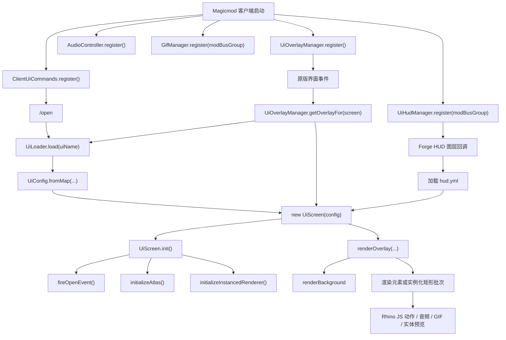

# 项目审计与路线图

## 文档范围

本文档用于总结 MagicMod 当前的运行时结构、核心调用链、面向 `1.21.11` 目标版本所做的环境与脚本修复，以及为“基岩版模型替换”准备过程中完成的内存与资源生命周期审计。

## 当前模块结构

- `org.test.magicmod.Magicmod`
  - Mod 启动入口、注册表接线、客户端特性注册。
- `org.test.magicmod.client`
  - `/open` 命令注册。
  - 背包、箱子、ESC 菜单、HUD 的界面覆盖层分发。
- `org.test.magicmod.ui`
  - YAML 解析、运行时元素树、渲染、动画、JS API、纹理图集、GIF 支持。
- `org.test.magicmod.audio`
  - 直接播放 `assets/magicmod/music` 下的 UI 音乐。
- `org.test.magicmod.mixin`
  - 拦截原版界面渲染，用于完整替换覆盖层。
- `src/main/resources/assets/magicmod/ui`
  - UI 配置定义与性能测试样例。

## 主要调用链

## 环境与脚本修复

- 目标版本已从 Minecraft `1.21.8` / Forge `58.1.11` 升级为 Minecraft `1.21.11` / Forge `61.1.3`。
- `run_client_java.bat`
  - 不再依赖写死的 `D:\jdk`。
  - 通过 `scripts/resolve_java_home.ps1` 自动定位有效的 JDK。
- `run_build.bat`
  - 不再假定仓库位于 `d:\ForgeMod\MagicMod`。
  - 已修正为执行 `gradlew build`，不再错误调用 `runClient`。
- `scripts/resolve_java_home.ps1`
  - 会搜索 `JAVA_HOME`、`PATH`、本机缓存 JDK 和常见 Windows 安装目录。
  - 当存在多个 JDK 时，优先选择 JDK 21。

## 内存与资源审计

### 已修复项

- `GifManager`
  - 问题：GIF 帧会被转换成 `DynamicTexture` 并永久缓存，但原来没有清理路径。
  - 修复：新增客户端资源重载和登出时的缓存清理，并逐个从 `TextureManager` 释放对应帧纹理。
- `UiTextureAtlas`
  - 问题：图集纹理对象会被关闭，但没有显式从 `TextureManager` 注销。
  - 修复：图集清理时先释放注册的纹理位置，再断开本地引用。
- `UiScreen`
  - 问题：动画、滚动、可见性覆盖、插槽提供器和移动键位补丁等临时状态会一直保留到 GC。
  - 修复：在 `removed()` 中主动清空临时集合并尽早断开引用。

### 仍需关注的点

- `UiOverlayManager` 通过 `WeakHashMap` 复用覆盖层 `UiScreen`，总体可接受，但重复 `init` 的开销仍应尽量保持轻量。
- `UiScriptEngine` 当前默认信任脚本；如果脚本作者写了长循环或高频动态创建元素，仍然可能造成用户侧性能问题。
- 图集与实例化路径已经接入，但仍是部分完成状态；`IMAGE` 目前还没有像 `RECT` 那样共享同一条完整优化渲染链。

## 短期路线

1. 先保证当前 YAML UI 路线在 Forge `61.1.3` 上稳定运行。
2. 将基岩版模型替换做成一条新的 UI 渲染分支，而不是继续硬塞到当前原版 `entity` 预览路径里。
3. 把模型动画状态迁移到可复用、可显式释放的运行时缓存中。
4. 在大规模渲染重构前，先为新的 Bedrock 运行时建立可持续的编译与验证链。

## 下一阶段交付物

- `bedrock_model` UI schema 与运行时实现。
- 几何体与动画资源缓存。
- 可从 YAML 与 JS 调用的骨骼动画播放 API。
- 面向 Bedrock UI 模型的专用 shader 路径，支持骨骼矩阵上传与更友好的批处理纹理绑定。
